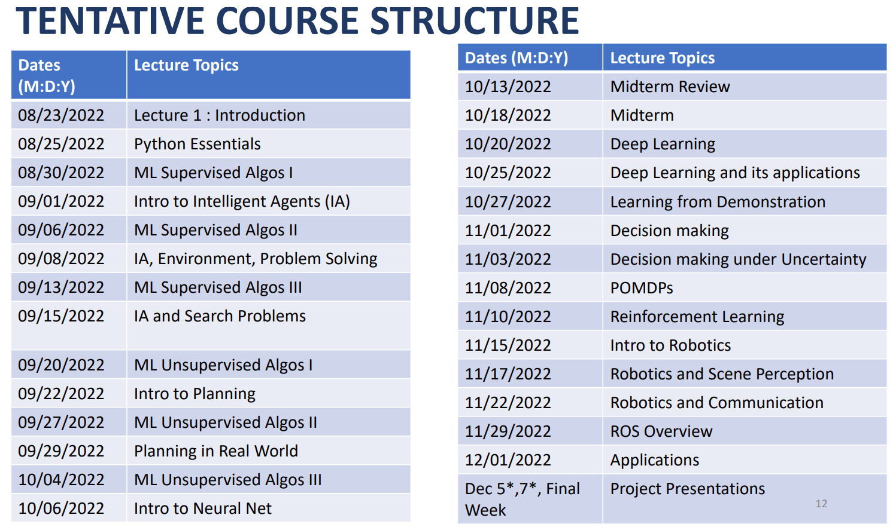

# Introduction to Artificial Intelligence
---
[Back](../README.md)

Syllabus day, woot woot

## General Info
No final exam - instead will have a project.

Topics include:
- Intelligent Agents and Decision making
- Machine Learning ALgorithms
- Deep learning
- Natural Language Processing
- Computer Vision
- Robotics

## Grading
5 Assignments: 50% of total grade
- based on programming (python)
- due Sundays 11:59pm
	- late assignments accepted at 10% penalty per day
- typed assignments preffered
	- ex) when using matplotlib, we'd be expected to type any reports on graphs
	- pdf is preferred
	- larctic is acceptable

10 quizzes: 10% of the total grade
- quizzes will be due Sunday 11:59pm
- quizzes have one attempt and a hard deadline

Midterm and Final
- 1 midterm 10%  of final grade
	- review before exams
- 1 final project 25% of final grade
- 1 page both sided handwritten cheat sheet is allowed (A4 size paper)
	- don't bring a typed cheat sheet
	- cheat sheet will need to be turned in with exam

Attendance: 5% of total grade
- before leaving class we'll sign an attendance sheet
- lecture materials will not be reiterated for students failing to attend previous lectures
- pdf versions of lectures will be uploaded to BS after lectures

100% = 50% Hw + 10% Quizzes + 10% midterm + 25% final project + 5% attendance

## Schedule

## Academic Integrity Policy
- plagiarism or any kind of academic dishonesty will not be tolerated
- students involved in academic dishonesty will be referred to the Dean of Students and will be given a failing grade

## Plagiarism
- Complete plagiarism: writer submits someone else's work in their own name
	- it is alright to use online sources as a reference -- **can't copy/paste**
	- "a plagiarism checker will be used"
- Direct plagiarism: passing-off of another writer's words as your own
	- same as complete plagiarism, but you're claiming you wrote the code
- Paraphrasing plagiarism: writer reuses another's work and changes a few words or phrases
	- changing variable names, function names, etc of another's code
- Accidental plagiarism: all of the above

## Electronic Devices and Online Policy
- usage of electronic devices are prohibed during class hours
- no recording the lecture
- zoom meetings require cameras on
- no electronic devices allowed during exams

## Course Outcome
At the end of this course, the student will become familiar with
- the basic pricniples of AI towards decision making
- have in depth knowledge of intelligent agents
- important machine learning models used for computer vision, natural language processing and robotics
- explore the current scope, limitations, and implications of AI