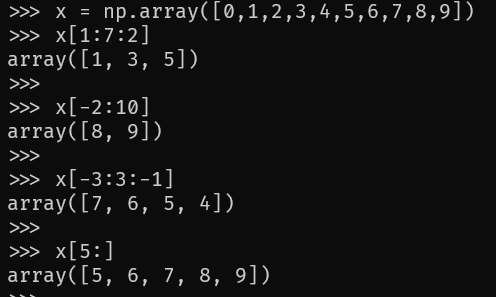

# Lecture 2 Losers
[Back](../README.md)

## Python
- Deep learning frameworks:
	- PyTorch
	- Keras
	- TensorFlow
- Platform dependent
- General purpose programming language

## Limitations of Python
- multiple versions of Python make it hard to maintain a codebase
- various dependencies for packages that may conflict or not work with certain versions of Python
- `pip` gives you access to multiple versions of packages
	- hard to know which to use
- dynamically typed language
	- runtime errors may occur infer Python infers the incorrect type
- indenting is a must
	- code won't run if not indented properly

## Python IDEs/editors
- PyCharm, Visual Studio, Vim are popular
- Python comes with a cli repl preinstalled
- Jupyter Notebook can be used as an online option
	- compatiable with Anaconda

## Basic Arithmetic Operators
```python
# addition
1 + 2

# subtraction
2 - 1

# multiplcation
2 * 2

#division
2 / 1

# modulus
4 % 2

# exponentiation
2 ** 2

# floor division
4 // 2
```

## Assignment Operators


## Comparison Operators


## Logical Operators


## Identity Operators
- `is` returns true if both variables are the same object
- `is not` returns true if both variables are not the same object

## Membership Operators
- `in` returns true if a sequence with the specified value is present in the object
- `not in` returns true if a seuqnce with the specified value is not present in the object

## Bitwise Operators


## Collections
- `List = [a, b, c]`
	- ordered
	- indexed
	- changeable
	- allows duplicates
- `Tuple = (a, b , c)`
	- ordered
	- indexed
	- unchangeable
	- allows duplicate values
- `Set = {"a", "b", "c"}`
	- unordered
	- unindexed
	- no duplicates
- Dictionary
	- key: value pairs
	- changeable
	- no duplicates
```python
# dictionary example
dict = {
	"course": "AI",
	"session": "Fall",
	"year": 2022
}
```

## [Numpy](https://numpy.org/)
- faster array operations
	- joining
	- splitting
	- slicing
	- etc...
- Compatibility with Scipy, MatplotLib, Pandas (other Python packages)

### Array Creation w/ Numpy
```python
import numpy as np

# 1D array
a1D = np.array([1,2,3,4])

# 2D array
a2D = np.array([1,2],[3,4])

# 3D array
a3D = np.array([[[1,2],[3,4]], [[5,6],[7,8]]])
```

- 1D arrays
	- `np.arrange` creates arrays with regularly incrementing values
	- `np.arrange(start:stop:step)`
		- `np.arrange(2,10,2)` = `array([2, 4, 6, 8])`
		- `np.arrange(10)` = `array([0,1,2,3,4,5,6,7,8,9])`
	- `numpy.linspace` creates arrays with a specified number of elements, and spaced equally between the specified beginning and end values
	- `np.linspace(1.,4.,6)` = `array([1., 1.6, 2.2, 2.8, 3.4, 4.])`
- 2D arrays
	- `np.diag` can define either a square 2D array with given values along the diagonal or if given a 2D array returns a 1D array that is only the diagonal elements
```python
>>> np.diag([1, 2, 3])
array([[1, 0, 0],
	  [0, 2, 0],
	  [0, 0, 3]])

>>> np.diag([1, 2, 3], 1)
array([[0, 1, 0, 0],
	  [0, 0, 2, 0],
	  [0, 0, 0, 3],
	  [0, 0, 0, 0]])
```
- 3D arrays
	- `numpy.ones` and `numpy.zeros` define arrays based on the desired criteria
```python
>>> np.zeros((2, 3))
array([[0., 0., 0.],
	  [0., 0., 0.]])

>>> np.ones((2,3))
array([[1., 1., 1.],
	  [1., 1., 1.]])

>>> np.zeros((2, 3, 2))
array([[[0., 0.],
	   [0., 0.],
	   [0., 0.]],
	   
	   [[0., 0.],
	   [0., 0.],
	   [0., 0.]]])

>>> np.ones((2, 3, 2))
array([[[1., 1.],
	   [1., 1.],
	   [1., 1.]]
	   
	   [[1., 1.],
	   [1., 1.],
	   [1., 1.]]])
```

### Indexing on `ndarrays`


### Array [Broadcasting](https://numpy.org/doc/stable/user/basics.broadcasting.html)
- describes how Numpy treats arrays with different shapes during arithmetic operations

- matrix takes form of first array/matrix


## Argmin Python
- `numpy.argmin` returns the indices of the minimum values along an axis
```python
a = np.array([[10,11,12],[13,14,15]])
np.argmin(1) # yields 0
```

## Matplotlib
### Line Plots
**TAKE A PICTURE OF THE REPL FOR THIS**

### Scatter Plots
**TAKE A PICTURE OF THE REPL FOR THIS**

### Bar plots
**TAKE A PICTURE OF THE REPL FOR THIS**

### Histograms
**TAKE A PICTURE OF THE REPL FOR THIS**

### Box Plots
**TAKE A PICTURE OF THE REPL FOR THIS**

