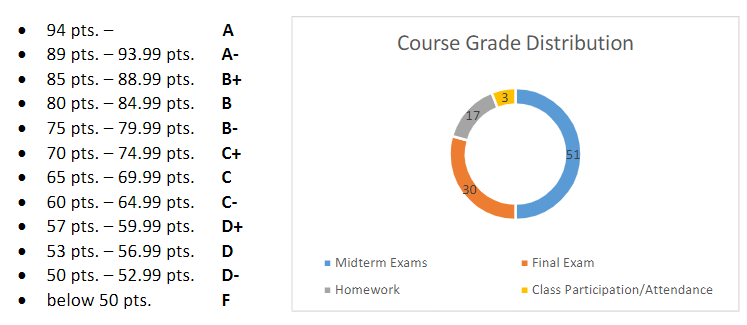

[Back](../README.md)

# Computational Mathematics

Today was a syllabus day, so not much to talk about.

Textbook is in the discord server.

No make-up exames/assignments will be given

## Assignments and Determination of Course Grade

- Exams
  - 3 midterm exams
  - 51pts of total grade
  - $E = [HighestScore + 2 *SecondHighest score + 6*(NumberOfExamsTaken - 2)]/6$
- Final Exam
  - 30pts of total grade
  - $F = ExamScore *0.3$
- Class Work
  - 17pts of total grade
  - $CW = Maximum 17pts$
- Class Participation
  - 3pts of total grade
  - 0.5pt penalty per absence
  - $CP = 3-absences*0.5$
- Course Project
  - gradue students only
  - minimum -10pts and maxium 0pts
  - $Project = Score-10$
    - cannot exceed 0
- $CPG=E+F+CW+CP(+Project)$
  
